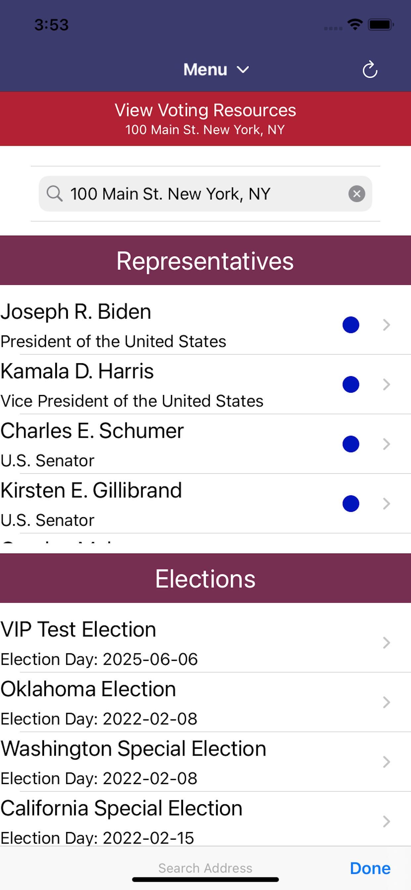
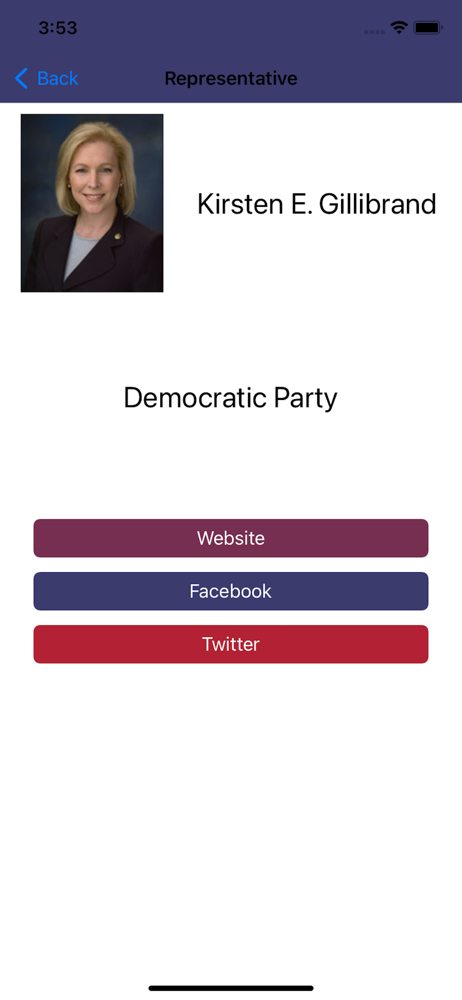
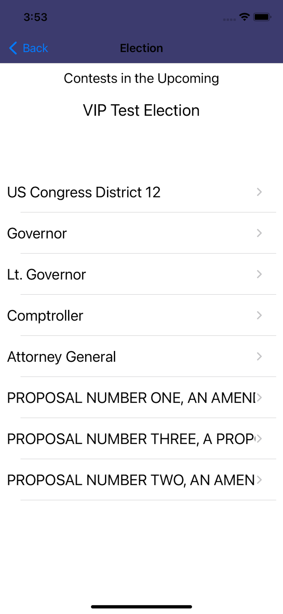
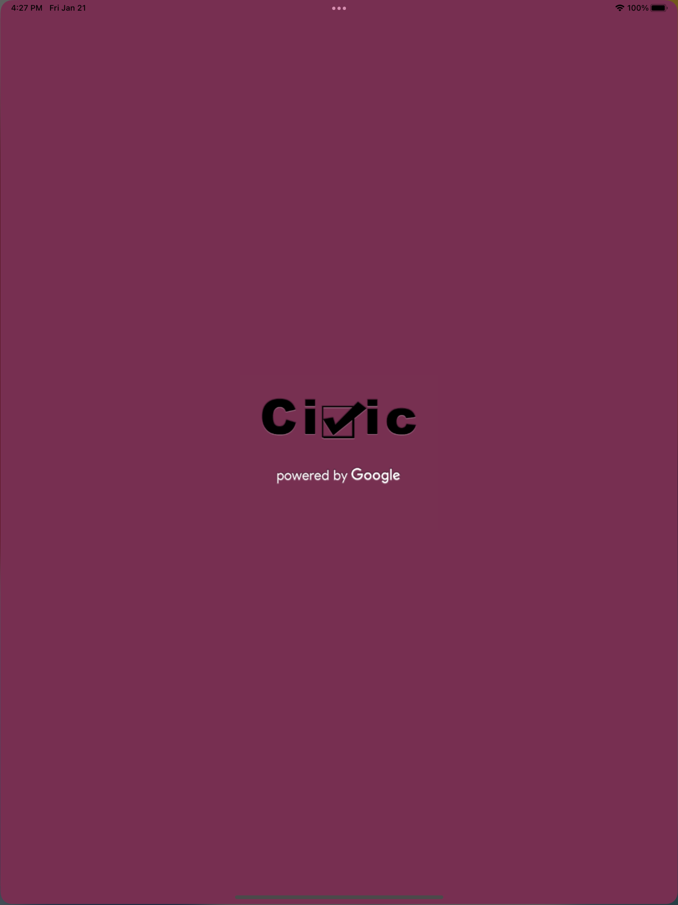
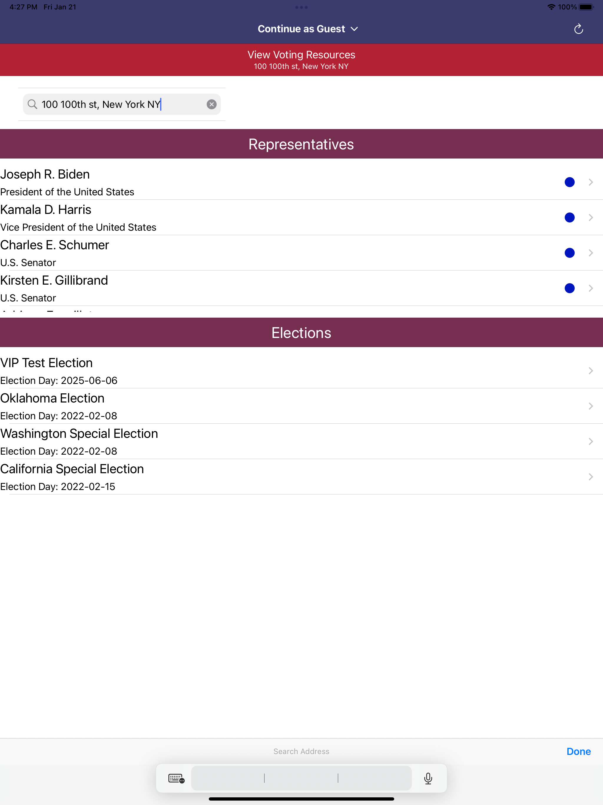
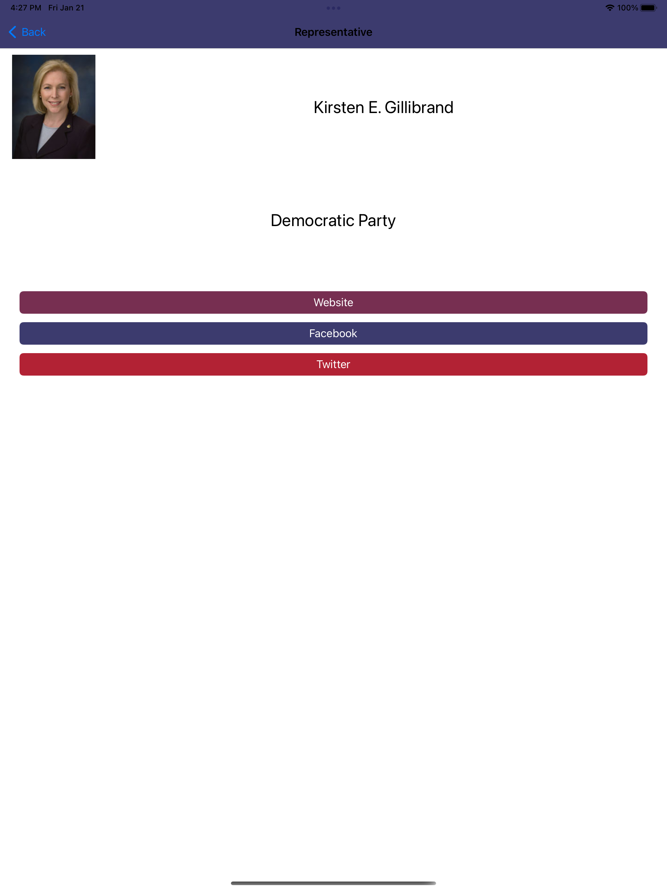
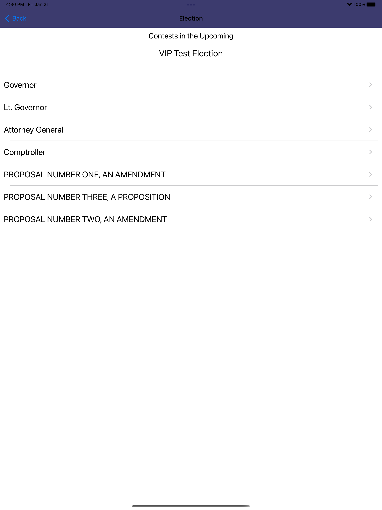
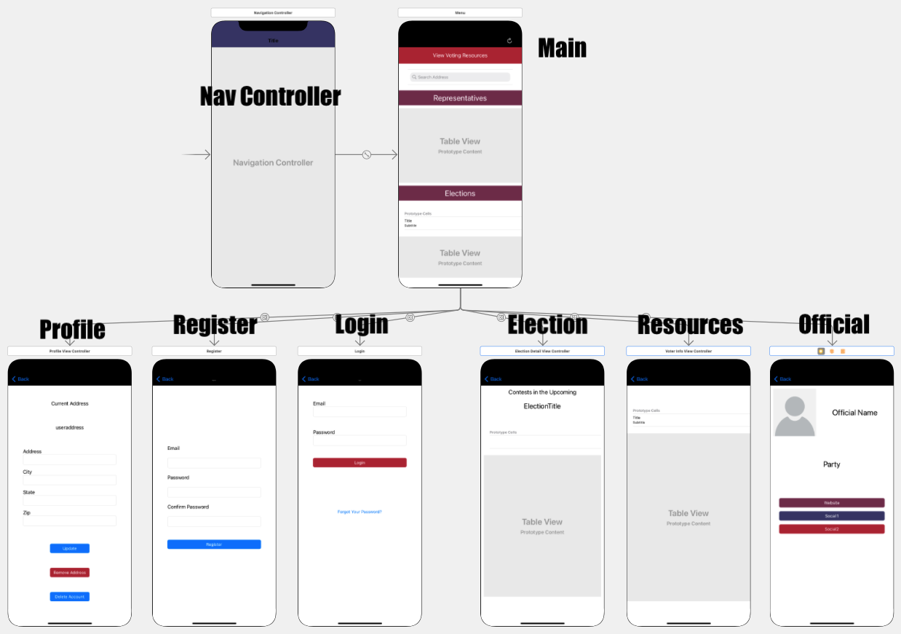
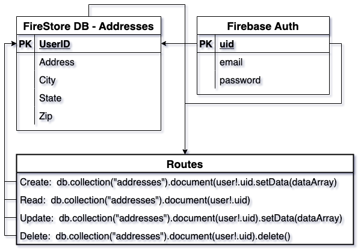

# Civic Voter Companion

## About

The Civic Voter Companion is an iOS App available onthe App Store designed to make civic engagement easier.

Powered by the Google Civic API, users have information about their elected representatives from the Federal down to the Local level at their fingertips. Not only is information available, but the Civic Voter Companion links directly to Officials website and social media accounts. Plus, direct links to State's voter resrouces including registration, absentee ballot information and more are just a touch away.

It is our hope, that the Civic Voter Companion will help make individuals more knowledgeable of who represents them, as well as how to participate at all levels of government.

Note: It is important to know that some information about elections, particularly local & special elections, as well as elected officals, is not available on this app. State, local, and/or federal election bodies should be consulted for the most accurate information

Please remember this app cannot be usesd to vote, register to vote, request an absentee ballot, etc.. It is for information purposes only.

## Features

- List Elected Officials for any US Address
- See all upcoming US Elections
- Access State Voting Resources
- Access Officials' websites & social media.
- User Authentication

## Screenshots

### iPhone

### iPad

## Requirements

- iPhone or iPad
- iOS 15.2+

## Installation

Search the AppStore for "Civic Voting Companion" or visit https://apps.apple.com/us/app/civic-voting-companion/id1606433760 to install on your iOS device.

## Technologies

- Swift Version 5
- iOS
- Firebase Authentication
- Firestore Database
- SwiftyJSON
- BTNavigationDropdownMenu
- IQKeyboardManager

## View Controller Diagram

## Database/Route Diagram

## Roadmap

Features and improvments we would like to see in the future are:

- Add Calendar/Notifications for elections
- Allow users to use their current loction when searching.
- Expand information available on Officials and Elections.
- Android Version
